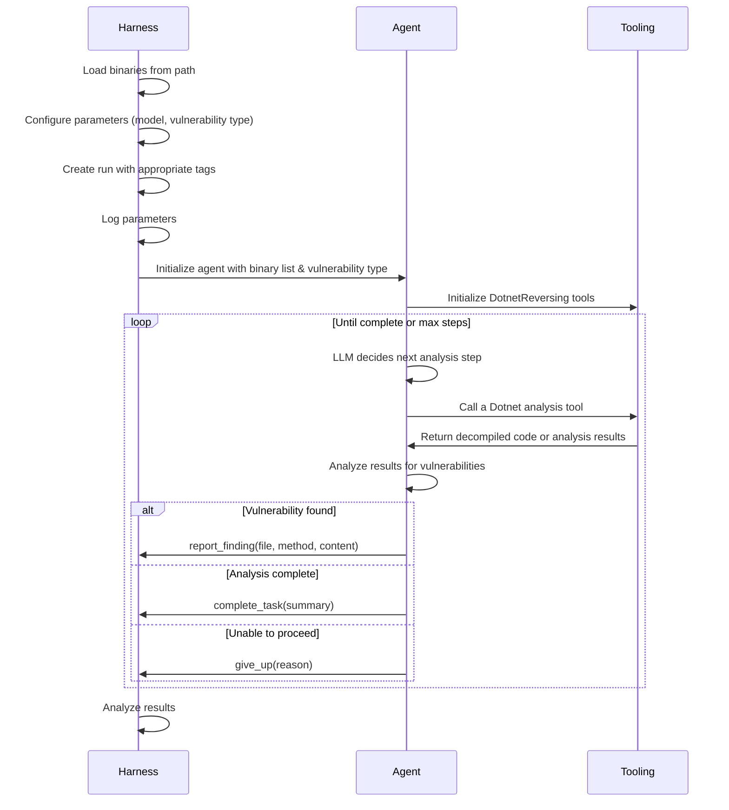

<Note>
This documentation complements the **"Dotnet Reversing"** example in [`dreadnode/example-agents`](https://github.com/dreadnode/example-agents). We'll reference specific components throughout, but you should explore the full implementation to understand how everything fits together.

We'll assume you have the `dreadnode` package installed and are familiar with the basics of Strikes. If you haven't already, check out the [installation](../install) and [introduction](../intro) guides.
</Note>

In this guide, we'll walk through building an agent for analyzing Dotnet binaries to identify security vulnerabilities and report them to the user. Unlike a more structured evaluation, this agent demonstrates an open-ended analysis task without known answers and specialized tools. We'll see how Strikes helps track agent use on real-world resources for tasks where success may not be as clearly defined as finding a flag.

<Tip>
Our agent use [Rigging](https://docs.dreadnode.io/rigging) to interact with the LLMs, provide tools, and track inference data. If you aren't already familiar, we recommend checking out the following resources:

- [Introduction](https://docs.dreadnode.io/open-source/rigging/intro)
- [Generators](https://docs.dreadnode.io/open-source/rigging/topics/generators)
- [Tools](https://docs.dreadnode.io/open-source/rigging/topics/tools)

The first point of confusing is usually what to pass to the `--model` argument, which is treated as an [identifier](https://docs.dreadnode.io/open-source/rigging/topics/generators#identifiers) to Rigging. Usually, the model name works as expected, but sometimes you need to supply a prefix like `gemini/` or `ollama/`:

```
gpt-4.1
claude-4-sonnet-latest
ollama/llama3-70b
gemini/gemini-2.5-pro
```
</Tip>

## Running the Agent

Before we dive into the implementation, let's get started running the agent to see it in action.

<Steps>
<Step title="Clone the `dreadnode/example-agents` repository">
```bash
git clone https://github.com/dreadnode/example-agents.git
cd example-agents
```

or if you already have it cloned, make sure it's up to date:

```bash
git pull origin main
```
</Step>

<Step title="Ensure Dotnet is installed">
For our reversing, we need the Dotnet runtime installed on your system. You can check if it's installed by running:

```bash
dotnet --info
```

Check out the [Microsoft Dotnet Installation Guide](https://dotnet.microsoft.com/en-us/download) for instructions on how to install the Dotnet runtime on your system.
</Step>

<Step title="Set your environment variables">
The `dreadnode` package can use environment variables to configure the target server and token for sending run data.

```bash
export DREADNODE_SERVER="https://platform.dreadnode.io" # default - otherwise use your self-hosted instance
export DREADNODE_API_KEY="your_api_key" # your platform API key
```

If you don't want to use environment variables, you can pass `--server` and `--token` arguments on the CLI.
</Step>

<Step title="Run the agent">
We'll use `gpt-4.1` as our model (requires a valid `OPENAI_API_KEY`) and decompile the `flag_protocol` binary from the example binaries provided in the repository.

```bash
uv run -m dotnet_reversing --model <model> --path dotnet_reversing/example_binaries/flag_protocol
```
</Step>
</Steps>

The agent will proceed to use tools like ILSpy and Cecil to analyze the provided binary, and report any findings related to vulnerabilities. You should see output similar to:

```text
| Analyzing the following binaries with the goal: 'Find only critical vulnerabilities':
|   |- FlagProtocol.dll
| list_methods(FlagProtocol.dll)
| decompile_methods(FlagProtocol.dll, [
    'FlagProtocol.FlagPacket::FromBytes(System.Byte[])',
    'FlagProtocol.FlagPacket::ToBytes()',
    'System.Boolean FlagProtocol.Program::_TheFlagCanBeCapturedWithoutReversing()',
    'FlagProtocol.Program::Main(System.String[])'
])
| search_for_references(FlagProtocol.dll, password)
| search_for_references(FlagProtocol.dll, crypto)
| search_for_references(FlagProtocol.dll, decrypt)
| search_for_references(FlagProtocol.dll, flag)
| decompile_module(FlagProtocol.dll)
| Reporting finding for FlagProtocol.dll (FlagProtocol.Program::Main(System.String[])) [critical]:
| The Main method broadcasts the full flag to anyone listening on the local network over UDP in cleartext,
with no authentication or encryption, as soon as the program executes. This exposes secret information to potential
attackers on the same network with no safeguards.
| ---
| Agent finished the task (success=True): ## Critical Vulnerability Found in `FlagProtocol.dll`

### Summary
The following critical vulnerability has been identified in the provided binary:
...
```

## Agent Design

Our Dotnet binary analysis agent is a simple case of "give an LLM tools and let it go". It uses a similar architecture to the CTF agent, but without any containerization and a more open-ended task.

1. **Tooling**: Providing Dotnet-specific analysis capabilities through Cecil and ILSpy
2. **Agent**: Exposing these tools to the LLM with Rigging
3. **Reporting**: Recording findings and metrics through Dreadnode

Here is a high-level diagram of how the agent works:



### Setting Up Dotnet Interop

We'll be using the following Dotnet libraries to orchestrate our reversing process:

- [Cecil](https://github.com/jbevain/cecil) for general processing of Dotnet assemblies
- [ILSpy](https://github.com/icsharpcode/ILSpy) for decompiling code in Dotnet assemblies

<Note>
The interop layer between Python and Dotnet is a great mechanism for building tools, but comes with some caveats. It requires the Dotnet runtime to be available on the system and can be particular about import order and assembly use. We have provided compiled binaries for the Dotnet core of the libraries we'll need in the `lib` folder.

Check out the [Microsoft Dotnet Installation Guide](https://dotnet.microsoft.com/en-us/download) for instructions on how to install the Dotnet runtime on your system.
</Note>

To run these in Python, we use [pythonnet](https://pythonnet.github.io/pythonnet/python.html) to load the Dotnet runtime and access these libraries. This allows us to decompile and analyze Dotnet binaries directly in our agent.

```python
import sys
from pathlib import Path
from pythonnet import load

load("coreclr")
import clr

lib_dir = Path(__file__).parent / "lib"
sys.path.append(str(lib_dir))

clr.AddReference("ICSharpCode.Decompiler")
clr.AddReference("Mono.Cecil")

from ICSharpCode.Decompiler import DecompilerSettings
from ICSharpCode.Decompiler.CSharp import CSharpDecompiler
from ICSharpCode.Decompiler.Metadata import MetadataTokenHelpers
from Mono.Cecil import AssemblyDefinition
```

### Analysis Tools

With the Dotnet libraries loaded, we can create helper functions for binary analysis:

```python
def _decompile_token(path: Path | str, token: int) -> str:
    entity_handle = MetadataTokenHelpers.TryAsEntityHandle(token.ToUInt32())
    return _get_decompiler(path).DecompileAsString(entity_handle)

def _find_references(assembly: AssemblyDefinition, search: str) -> list[str]:
    flexible_search_strings = [
        search.lower(),
        search.lower().replace(".", "::"),
        search.lower().replace("::", "."),
    ]

    using_methods: set[str] = set()
    for module in assembly.Modules:
        methods = []
        for module_type in module.Types:
            for method in module_type.Methods:
                methods.append(method)

        for method in methods:
            if not method.HasBody:
                continue

            for instruction in method.Body.Instructions:
                intruction_str = str(instruction.Operand).lower()

                for _search in flexible_search_strings:
                    if _search in intruction_str:
                        using_methods.add(method.FullName)

    return list(using_methods)
```

We wrap all our analysis capabilities in a `DotnetReversing` class that:

1. Discovers binaries in a target directory
2. Exposes LLM-compatible tools for analyzing these binaries
3. Ensures our agent only has access to the binaries we want it to analyze

```python
@dataclass
class DotnetReversing:
    base_path: Path
    binaries: list[str]

    @classmethod
    def from_path(
        cls,
        path: Path | str,
        pattern: str = "**/*",
        exclude: list[str] = DEFAULT_EXCLUDE,
    ) -> "DotnetReversing":
        base_path = Path(path)
        if not base_path.exists():
            raise ValueError(f"Base path does not exist: {base_path}")

        binaries: list[str] = []
        for file_path in base_path.rglob(pattern):
            rel_path = file_path.relative_to(base_path)
            if not any(ex in str(rel_path) for ex in exclude):
                binaries.append(str(rel_path))

        if not binaries:
            raise ValueError(
                f"No binaries found in {base_path} ({pattern})",
            )

        return cls(base_path=base_path, binaries=binaries)
```

<Tip>
The `from_path` class method provides a convenient way to discover all relevant binaries in a directory, while filtering out unwanted files like system libraries.

If you have a fixed set of binaries, you can also pass them directly to the `DotnetReversing` constructor along with their relative base path.
</Tip>

Let's look at a couple of capabilities our `DotnetReversing` class exposes:

```python
def search_for_references(
    self,
    path: t.Annotated[str, "The binary file path"],
    search: t.Annotated[str, "A flexible search string used to check called function names"],
) -> list[str]:
    """
    Locate all methods inside the assembly that reference the search string.

    This can be used to locate uses of a specific function or method anywhere in the assembly.
    """
    # ...

def get_call_flows_to_method(
    self,
    paths: t.Annotated[
        list[str],
        "Paths of all Dotnet assemblies to consider as part of the search",
    ],
    method_name: t.Annotated[str, "Target method name"],
    *,
    max_depth: int = 10,
) -> list[list[str]]:
    """
    Find all unique call flows to the target method inside provided assemblies and
    return a nested list of method names representing the call paths.
    """
    # ...
```

ILSpy and Cecil provide a ton of additional functionality you could implement, but we'll keep the basic
set focused on the most common tasks:

- **Decompilation**: Decompile a specific module, type, or method
- **Method listing**: List all methods in a module or type
- **Reference analysis**: Find methods that reference a specific string
- **Call flow analysis**: Create a call flow graph to a target method

When it comes time to use these methods as tools in Rigging, we can easily wrap them up:

```python
@cached_property
def tools(self) -> list[t.Callable[..., t.Any]]:
    return [
        rg.tool(catch=True)(dn.task()(func))
        for func in (
            self.decompile_module,
            self.decompile_type,
            self.decompile_methods,
            self.list_types,
            self.list_methods,
            self.search_for_references,
            self.get_call_flows_to_method,
        )
    ]
```

<Note>
Notice how we combine Rigging's `rg.tool` with Dreadnode's `dn.task` to create tools that are both:
1. Exposed to the LLM for use in its decision-making
2. Tracked by Dreadnode for performance monitoring

The runtime syntax is essentially applying decorators which could look like this:

```
@rg.tool(catch=True)
@dn.task()
def func():
    # ...
```

This prevents a little code duplication and let's us make easy changes to our tool and task configs for all methods.
</Note>

### Lifecycle Tools

In addition to our analysis tools, we want to add some additional tools to let the agent report findings and manage it's lifecycle. Reporting findings is particularly important here as it's the target output from our Agent. A strong agent would yield rich findings for a human to review, but we can also use this to track the agent's performance and success rate if we have reference data to compare against.

```python
@dn.task(name="Report finding")
async def report_finding(file: str, method: str, content: str) -> str:
    """
    Report a finding regarding areas or interest or vulnerabilities.
    """
    logger.success(f"Reporting finding for {file} ({method}):")
    logger.success(content)
    dn.log_metric("reports", 1)
    return "Reported"

@dn.task(name="Give up")
async def give_up(reason: str) -> None:
    """
    Give up on your task.
    """
    logger.warning(f"Agent gave up: {reason}")
    dn.log_metric("gave_up", 1)

@dn.task(name="Complete task")
async def complete_task(summary: str) -> None:
    """
    Complete the task.
    """
    logger.info(f"Agent completed the task: {summary}")
    dn.log_metric("completed", 1)
```

These reporting tools let the agent:
1. Document specific vulnerabilities it finds
2. Indicate when its analysis is complete
3. Give up if it can't make progress

### Agent Implementation

With our tools defined, the last step is to tie everything together with a [Rigging](https://github.com/dreadnode/rigging) pipeline inside a Strikes run and task.

```python
@app.default
async def agent(*, args: Args, dn_args: DreadnodeArgs | None = None) -> None:

    dn_args = dn_args or DreadnodeArgs()
    dn.configure(
        server=dn_args.server,
        token=dn_args.token,
        project=dn_args.project,
        console=dn_args.console,
    )

    # We can open a run, and a dynamic task span at the same time
    with dn.run(tags=[args.vulnerability]), dn.task_span("Agent"):
        dn.log_params(
            model=args.model,
            vulnerability=args.vulnerability,
            directory=str(args.path),
            max_steps=args.max_steps,
        )

        # Create the reversing object
        reversing = DotnetReversing.from_path(args.path)
        binary_list = "\n".join(reversing.binaries)

        # Create and run the LLM agent
        generator = rg.get_generator(args.model)
        chat = (
            await generator.chat(
                f"""\
            Analyze the following binaries for vulnerabilities related to "{args.vulnerability}" using all
            the tools available to you. Provide a report for all interesting findings you discover
            while analyzing the binaries.

            <files>
            {binary_list}
            </files>
            """,
            )
            .catch(
                *litellm.exceptions.LITELLM_EXCEPTION_TYPES,
                on_failed="include",
            )
            .using(
                reversing.tools,
                report_finding,
                give_up,
                complete_task,
                max_depth=args.max_steps,
            )
            .run()
        )

        # Handle any errors on the `chat` object
        # ...
```

This function:
1. Sets up the Dreadnode run with appropriate tags
2. Loads the binaries for analysis
3. Creates an LLM agent with a context-specific prompt
4. Connects the agent to the analysis tools
5. Runs the agent and tracks its performance

The only real item we control in this prompt is the specific vulnerability type we want the agent to focus on. Because the agent has the capability to search for references to particular strings inside binaries, it's a quick process for the agent to begin identifying functions of interest inside the binaries and start decompilation from there.

### Metrics

Unlike CTF challenges with clear "flag found" success criteria, evaluating binary analysis is more nuanced. We track several metrics to help us understand the agents behavior, but you'll note a specific lack of any "success" metric. Instead, we focus on the following:

```python
dn.log_metric("reports", 1)            # Count vulnerability reports
dn.log_metric("gave_up", 1)            # Agent couldn't make progress
dn.log_metric("completed", 1)          # Agent completed its analysis
dn.log_metric("max_steps_reached", 1)  # Hit maximum steps
```

These metrics help us understand:
1. How effective different models are at finding vulnerabilities
2. How often agents get stuck or reach max steps
3. How the vulnerability type affects analysis performance

## Next Steps

To extend this binary analysis agent, consider:

1. Adding more specialized tools for other vulnerability types
2. Implementing automatic exploitation verification
3. Expanding to other languages and runtimes beyond Dotnet
4. Integrating with existing security scanning tools

The architecture is flexible enough to accommodate these extensions while maintaining the same core workflow.
